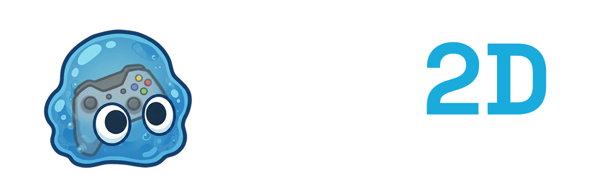
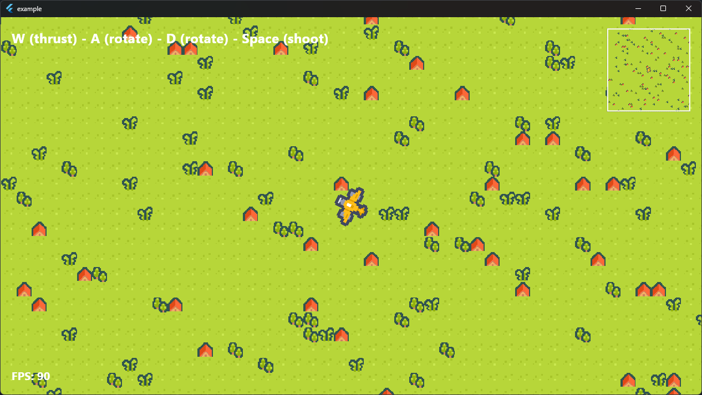

# GOO2D

[](https://sunarya-thito.github.io/goo2d)
[](https://github.com/sunarya-thito/goo2d/actions/workflows/deploy_docs.yml)
[](https://flutter.dev)
[](https://opensource.org/licenses/BSD-3-Clause)


[**Explore the Documentation »**](https://sunarya-thito.github.io/goo2d)

> **⚠️ Under Heavy Development**
>
> GOO2D is currently in an early, active phase of heavy development. The APIs are subject to change rapidly. At this moment, we **may not accept external contributions**, as the core architecture is still being finalized.

A low-level 2D Entity-Component-System (ECS) engine built natively for Flutter. 

GOO2D strips away standard UI boilerplate, providing the architectural primitives—GameObjects, Components, Coroutines, and Swept Collision—required to build games directly on the Flutter Canvas.



## Technical Highlights

* **Strict Entity-Component Architecture:** No inheritance spaghetti. Compose your game logic strictly through `GameObject`s and `Component`s.
* **Sequential Coroutines:** Stop relying on messy Timers. Write state machines and timing logic sequentially using `startCoroutine` and native yield instructions like `WaitForSeconds`.
* **Sweep-and-Prune Collision:** Kinematic, AABB-based broadphase collision detection out of the box via `BoxCollisionTrigger`.
* **Abstracted Input System:** Map raw keyboard and pointer data to logical `InputAction`s using composite bindings.

## The 60-Second Quickstart

Building a game world uses the standard Flutter `build` syntax you already know, paired with a dedicated `onUpdate` game loop.

```dart
import 'package:flutter/material.dart';
import 'package:goo2d/goo2d.dart';

class Player extends StatefulGameWidget {
  const Player({super.key});
  @override
  PlayerState createState() => PlayerState();
}

class PlayerState extends GameState<Player> with Tickable {
  @override
  void initState() {
    super.initState();
    // 1. Attach components to give your object physical presence
    addComponent(
      ObjectTransform()..position = const Offset(50, 50),
      BoxCollisionTrigger()..rect = const Rect.fromLTWH(0, 0, 50, 50),
    );
  }

  @override
  void onUpdate(double dt) {
    // 2. The engine ticks this automatically every frame
    final transform = getComponent<ObjectTransform>();
    transform.position += Offset(100 * dt, 0); 
  }

  @override
  Iterable<Widget> build(BuildContext context) sync* {
    // 3. Yield your visual representation
    yield const Text('🚀', style: TextStyle(fontSize: 40));
  }
}
```

### Mount the Engine

```dart
void main() {
  runApp(
    const MaterialApp(
      home: Scaffold(
        body: Game(
          // The Game widget handles the Ticker, Input, and Collision passes
          child: Player(), 
        ),
      ),
    ),
  );
}
```

## Try the Example

The repository includes a complete top-down battle example demonstrating movement, rotation, shooting mechanics, HUD layering, and collision handling. 

Run it directly from the `/example` directory:
```bash
cd example
flutter run
```
